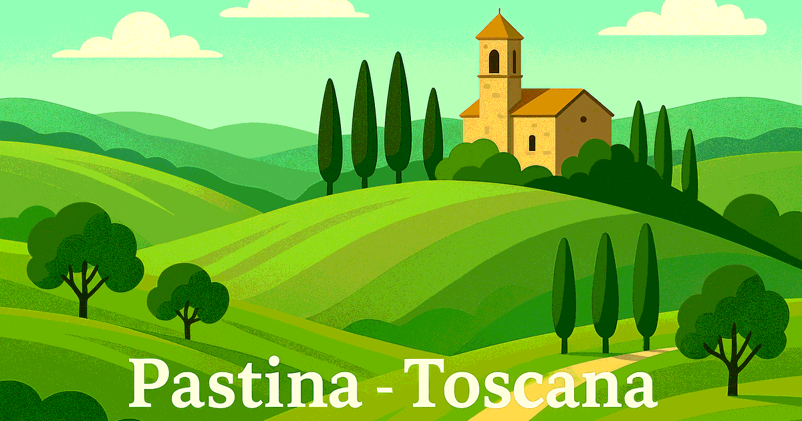

# Pastina Explorer

[Pastina page itself: https://pastina.reznitsky.info/](https://pastina.reznitsky.info/)

A lightweight static website for discovering local places (restaurants, shops, services) in the Pastina area near Santa Luce, Tuscany. It loads POI data from a gzip-compressed JSON file, supports filtering by category, text search, and shows open/closed status based on current time. The site is built and minified via `build.sh` and deployed with `deploy.sh`. 

This project was generated with the assistance of AI (Claude, Anthropic).

